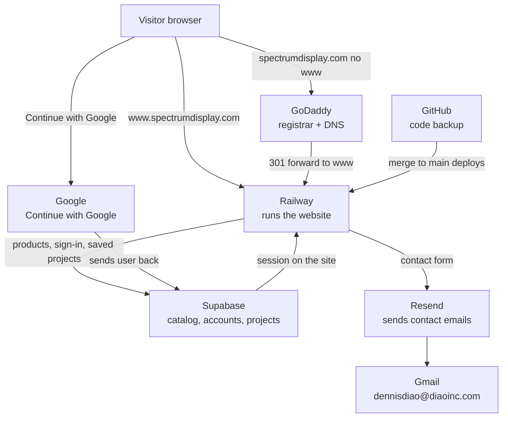

# How Spectrum Display stays online

Use this when something breaks. Each row is one app. The **If it breaks** column is what customers (or you) will notice.

**Public site:** https://www.spectrumdisplay.com  
**Your login email for almost everything:** `dennisdiao@diaoinc.com`

---

## Big pieces (the site cannot run without these)

### 1. GoDaddy — domain name

| | |
|---|---|
| **What it is** | Where you bought `spectrumdisplay.com`. Also hosts DNS (the phone book of the internet). |
| **Account** | `dennisdiao@diaoinc.com` |
| **Dashboard** | https://dcc.godaddy.com or godaddy.com → Domain → `spectrumdisplay.com` |
| **What it does** | Owns the name. Nameservers: `ns37.domaincontrol.com` / `ns38.domaincontrol.com`. |
| **DNS that matters** | See [DNS cheat sheet](#dns-cheat-sheet) below. |
| **If it breaks** | The name does not load, or www goes to Coming Soon / “Not secure”, or contact email stops (Resend DNS lives here too). |

**Bare domain (no www):** GoDaddy **Forwarding** sends `spectrumdisplay.com` → `https://www.spectrumdisplay.com` (301). Railway Trial only allows **one** custom domain, and that slot is `www`. GoDaddy cannot CNAME the apex to Railway.

---

### 2. Railway — the computer that runs the website

| | |
|---|---|
| **What it is** | Hosting. Node/Express (`npm start`) serves HTML and `/api/*`. |
| **Account** | `dennisdiao@diaoinc.com` |
| **Dashboard** | https://railway.com → project **spectrum-display** → service **web** |
| **Public URLs** | https://www.spectrumdisplay.com and backup https://web-production-51ccb.up.railway.app |
| **Railway CNAME target** | `www` → `12f3f64q.up.railway.app` |
| **What it does** | Serves pages, `/api/catalog`, `/api/config`, `/api/contact`, admin APIs. Issues HTTPS for **www** (Let’s Encrypt). |
| **GitHub hook** | Service **web** deploys from GitHub repo `dennisdiao23/spectrum-display`, branch **`main`**. Merge to main = live update. |
| **If it breaks** | Site down, 502, old version after you merged, contact form JSON errors, admin cannot save products. Check **Deployments** and **Logs**. |

**Env vars on Railway (web / production)** — never put these in GitHub:

| Variable | Job |
|---|---|
| `SUPABASE_URL` | Where the database lives |
| `SUPABASE_ANON_KEY` | Public key the site uses to talk to Supabase |
| `SPECTRUM_ADMIN_SECRET` | Lets the server write catalog as admin |
| `NODE_ENV=production` | Secure cookies, production mode |
| `CONTACT_TO_EMAIL` | Inbox: `sales@spectrumdisplay.com` |
| `CONTACT_FROM_EMAIL` | `Spectrum Display <hello@send.spectrumdisplay.com>` |
| `RESEND_API_KEY` | Password for sending mail |
| `PORT` | Set by Railway (do not hardcode) |

`ADMIN_PASSWORD` is **not** required on Railway (admin user already exists in Supabase).

---

### 3. GitHub — code

| | |
|---|---|
| **What it is** | Backup of every HTML/JS/server file. Not the live site by itself. |
| **Account** | `dennisdiao23` |
| **Repo** | https://github.com/dennisdiao23/spectrum-display (public) |
| **What it does** | Stores code. Push/merge to **`main`** tells Railway to rebuild. |
| **If it breaks** | You cannot save work, or Railway does not deploy (check Railway is still connected to this repo / `main`). The live site can still run on the last good deploy. |

**Your PC copy:** `C:\Users\denni\OneDrive\Desktop\spectrum-display`  
OneDrive does **not** update GitHub. After Cloud Agent changes, pull and review on localhost — full steps: [LOCAL-REVIEW.md](LOCAL-REVIEW.md).

---

### 4. Supabase — database, customer login, photos

| | |
|---|---|
| **What it is** | Online Postgres + Auth + file storage. Project name **SPECTRUM**. |
| **Ref / URL** | `mzwgqbnfbfjczasvddan` → https://mzwgqbnfbfjczasvddan.supabase.co |
| **Dashboard** | https://supabase.com/dashboard/project/mzwgqbnfbfjczasvddan |
| **Account** | `dennisdiao@diaoinc.com` (GitHub/Google sign-in to Supabase) |
| **If it breaks** | Empty catalog, cannot Sign in, saved projects missing, contact form saves fail, product photos 404. |

**Auth URLs (Authentication → URL Configuration)**

- Site URL: `https://www.spectrumdisplay.com`
- Redirects: `https://www.spectrumdisplay.com/**` and `https://web-production-51ccb.up.railway.app/**`

**Tables (what each is for)**

| Table | Who uses it |
|---|---|
| `brands`, `products` | Public catalog |
| `admins`, `sessions` | Catalog admin at `/admin.html` (not customer Sign in) |
| `app_config` | Admin secret check |
| `profiles` | Site accounts. Role is `customer` (default), `dealer`, or `sales`. Only Admin can change type. |
| `saved_projects`, `custom_panels` | Designer saves (online, per user) |
| `orders` | Cart checkouts stored online so Admin can see them |
| `contact_inquiries` | Copy of each contact-form submit |

**Storage:** bucket `product-images` (public product photos).

**Customer Sign in** = Supabase Auth (email/password + Google).  
**Catalog admin** = `admin.html` + `admin@spectrumdisplay.com` (separate).

---

### 5. Google — Continue with Google

| | |
|---|---|
| **What it is** | Lets customers sign in with a Gmail/Google account. |
| **Google Cloud project** | `big-unison-420919` |
| **Console** | https://console.cloud.google.com → that project → **APIs & Services** → **Credentials** / **OAuth consent screen** |
| **Callback (do not change)** | `https://mzwgqbnfbfjczasvddan.supabase.co/auth/v1/callback` |
| **JavaScript origin** | `https://www.spectrumdisplay.com` (and Railway URL if you still use it) |
| **Status** | **In production** (not Testing). Any Google account can sign in. |
| **If it breaks** | Continue with Google errors, “redirect_uri_mismatch”, “origin not allowed”, or lands on the old Railway URL. Fix origins here **and** Site URL in Supabase. |

Email/password Sign in does **not** need Google. Only the Google button does.

---

### 6. Resend — contact form email

| | |
|---|---|
| **What it is** | Sends the contact form to sales@spectrumdisplay.com. |
| **Dashboard** | https://resend.com |
| **From** | `hello@send.spectrumdisplay.com` |
| **To** | `sales@spectrumdisplay.com` |
| **Domain** | `send.spectrumdisplay.com` must stay **Verified** (DNS on GoDaddy). |
| **If it breaks** | Form says it failed, or you get no email. Check Resend **Logs**, Railway logs (`Contact form error`), and GoDaddy records for `send`. |

Inquiries are also stored in Supabase `contact_inquiries` even if mail fails (if the server could reach the database).

---

### 7. Gmail — where contact mail arrives

| | |
|---|---|
| **Inbox** | `sales@spectrumdisplay.com` |
| **What it does** | Receives Resend messages. Reply-To is the visitor’s email. |
| **If it breaks** | Check **Spam**. From address is `hello@send.spectrumdisplay.com`. |

Gmail App Passwords were **not** available on this account. That is why we use Resend, not Gmail SMTP.

---

### 8. Google Search — so www.spectrumdisplay.com shows up in Google

This is separate from **Continue with Google** (customer Sign in). Search Console is how Google learns the site exists.

| | |
|---|---|
| **What it is** | Google’s dashboard for indexing `spectrumdisplay.com`. |
| **Dashboard** | https://search.google.com/search-console |
| **Account** | `dennisdiao@diaoinc.com` |
| **If it breaks** | Searching the domain or “Spectrum Display” does not show this site. Other companies (`spectrumdisplay.cn`, `spectrum-display.com`) can still rank first for the brand name. |

The site is crawlable. Google just has to be asked, then given time. Code already has `robots.txt`, `/sitemap.xml`, and page titles/descriptions.

**One-time setup (you do this in the browser):**

1. Merge this work to **`main`** and wait until Railway **web** is **SUCCESS**.
2. Open https://search.google.com/search-console with `dennisdiao@diaoinc.com`.
3. Add property → **Domain** → `spectrumdisplay.com` (covers www and no-www).
4. Google shows a **TXT** record. In GoDaddy → DNS → add **TXT**, Name `@`, Value = the string Google gives you. Wait until Google says verified (can take minutes to a day).
5. In Search Console: **Sitemaps** → submit `https://www.spectrumdisplay.com/sitemap.xml`.
6. **URL inspection** → paste `https://www.spectrumdisplay.com/` → **Request indexing**.

Do **not** paste the Google TXT value into GitHub. It lives in GoDaddy only.

Indexing is not instant. `site:spectrumdisplay.com` should start showing pages after Google crawls. Ranking for “Spectrum Display” against older companies can still take longer.

---

## Smaller pieces (site still loads if these wobble)

| App / piece | Job | If it breaks |
|---|---|---|
| **Cursor** (Desktop + Cloud Agents) | You edit code. Cloud Agent can deploy via GitHub/`main`. | You cannot edit in that tool. Site stays up. |
| **Tailwind CDN** (`cdn.tailwindcss.com`) | Page styling | Site looks unstyled. |
| **Google Fonts** (Inter) | Fonts | Fallback system font. |
| **Supabase JS CDN** | Customer auth in the browser | Sign in / saved projects fail. Catalog may still load via `/api/catalog`. |
| **Let’s Encrypt (via Railway)** | HTTPS padlock on **www** | Browser warns on www. |
| **GoDaddy SSL** | HTTPS on the **apex forward** | `https://spectrumdisplay.com` (no www) looks Not secure, but www can still be fine. |
| **localStorage cart / orders** | Cart in **this browser only**, and only after Sign in | Not a server. Guests do not see prices or cart. Clearing cookies/cache empties cart. Not shared across phones. |

**Not used for hosting:** Netlify, Vercel. The site is Railway only.

---

## DNS cheat sheet (GoDaddy → DNS Records)

Leave NS (`ns37` / `ns38`) and SOA alone.

| Type | Name | Points at | Why |
|---|---|---|---|
| CNAME | `www` | `12f3f64q.up.railway.app` | Real website |
| TXT | `_railway-verify.www` | `railway-verify=…` | Railway ownership |
| A | `@` | GoDaddy forwarding IPs | No-www → www (do not delete; they have a lock/info icon) |
| TXT / MX | `send` / `resend._domainkey.send` | Resend values | Contact email |
| TXT | `_dmarc` | DMARC policy | Email reputation |
| TXT | `@` | Google Search Console value (after you add the property) | Proves you own the domain for Google search |
| CNAME | `pay` | GoDaddy commerce | Optional GoDaddy feature |

**Forwarding tab:** `spectrumdisplay.com` → `https://www.spectrumdisplay.com`, 301, no masking.

---

## What we built (timeline, plain language)

1. Static LED catalog site (HTML + Express).
2. Catalog + admin moved to **Supabase**; photos in **product-images**.
3. Customer accounts (email + **Google**); saved designer projects online.
4. Put the app on **Railway**; GitHub repo **spectrum-display**.
5. Pointed **www.spectrumdisplay.com** (GoDaddy) at Railway; apex **forwards** to www.
6. Google OAuth **published** so any Google user can Continue with Google.
7. **Contact form** emails you via **Resend** → Gmail; copy stored in Supabase.
8. **GitHub `main` → Railway** auto-deploy turned on.
9. **Google Search Console** — `robots.txt`, sitemap, page descriptions. You still verify the domain in Search Console (see section 8).

---

## “X is broken” → which app

| Symptom | Look at first |
|---|---|
| www does not load / 502 | Railway deployments + logs |
| No-www does not jump to www | GoDaddy Forwarding + `@` A records |
| Not secure in Chrome only | Chrome cache / HSTS (`chrome://net-internals/#hsts`) — Edge was fine before |
| Catalog empty / no products | Supabase tables `products` / `brands`; Railway `SUPABASE_*` vars |
| Cannot Sign in (email) | Supabase Auth; Site URL must be `https://www.spectrumdisplay.com` |
| Continue with Google fails | Google Cloud OAuth origins + Supabase redirect URLs |
| Contact form error / no email | Railway logs → Resend logs → Gmail spam → `send` DNS |
| Admin cannot add products | `admin.html` (not customer Sign in); `SPECTRUM_ADMIN_SECRET` |
| Admin Accounts tab empty | Catalog admin can only see site Sign in accounts (`profiles`). Needs the admin secret so RLS allows the list. |
| Merged on GitHub, site unchanged | Railway must show a new deploy for that commit on **main** |
| Cart empty on another phone | Expected — cart is not in Supabase |
| Domain not in Google search | Search Console property + sitemap (section 8). Not a Railway outage. |

---

## Day-to-day (how you said you want to work)

1. Edit files (local Cursor or Cloud Agent).
2. Commit and merge to **`main`** on GitHub.
3. Watch Railway **web** until the new deploy is **SUCCESS**.
4. Check https://www.spectrumdisplay.com

Do not paste API keys, admin passwords, or `SPECTRUM_ADMIN_SECRET` into GitHub.
